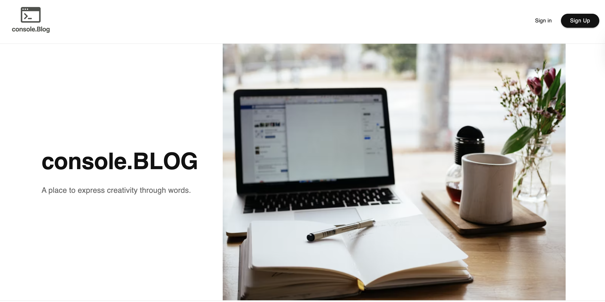
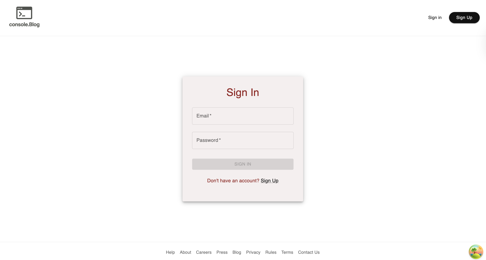
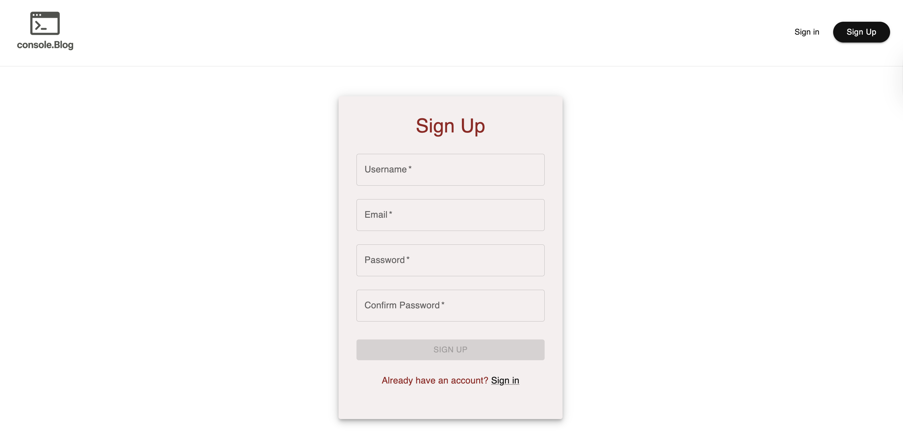
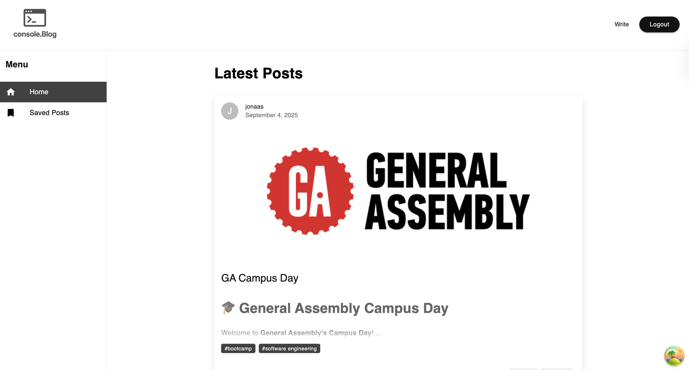
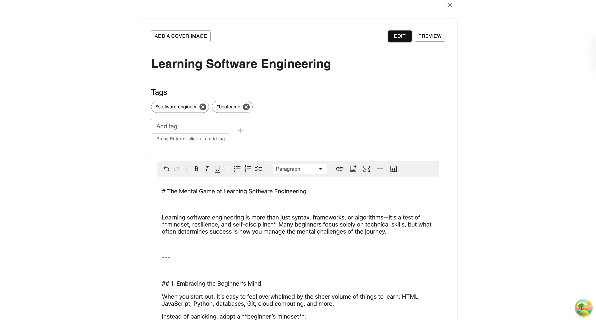
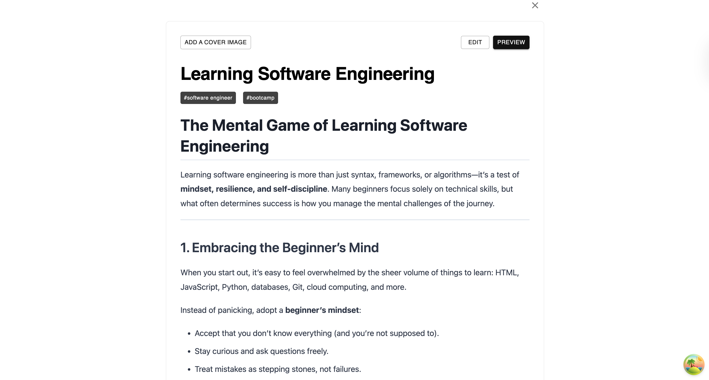
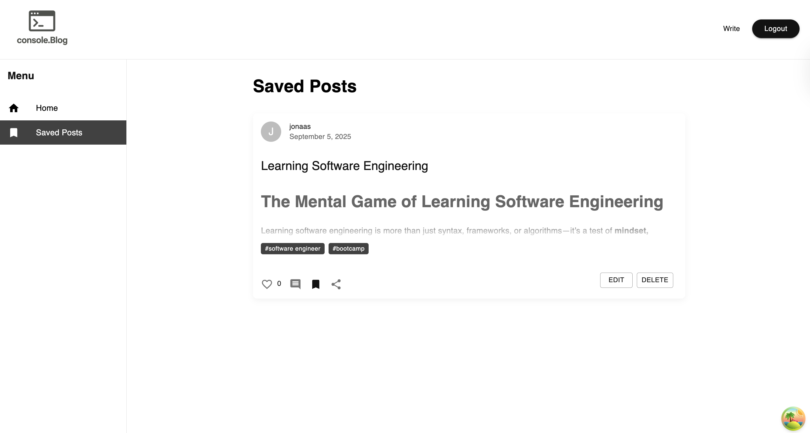

# [console.Blog]

 

A personal blog post to pen down my own thoughts, and also a portfolio to showcase future collaborations and opportunities for my work.

## 🚀 Demo

[Click here to view the application!]()

## 📸 Screenshots

## ✨ Features

-   **Feature 1:** Describe a key feature.
-   **Feature 2:** Describe another key feature.
-   **User Authentication:** Secure login and logout.
-   **Fully Responsive:** Works on all device sizes.

## 🛠️ Built With

-   **Frontend:** React, Typescript, MUI
-   **Backend:** Node.js, Express.js
-   **Database:** MongoDB
-   **Authentication:** JWT, bcrypt

## 💻 Local Development

## 🚧 Future Enhancements

-   [ ] email verification
-   [ ] OAuth
-   [ ] Role-based access
-   [ ] User Profile customisation

## 🙏 Acknowledgements

-   Inspiration from [Medium](https://medium.com)
-   My bootcamp cohort and instructors for the support!
